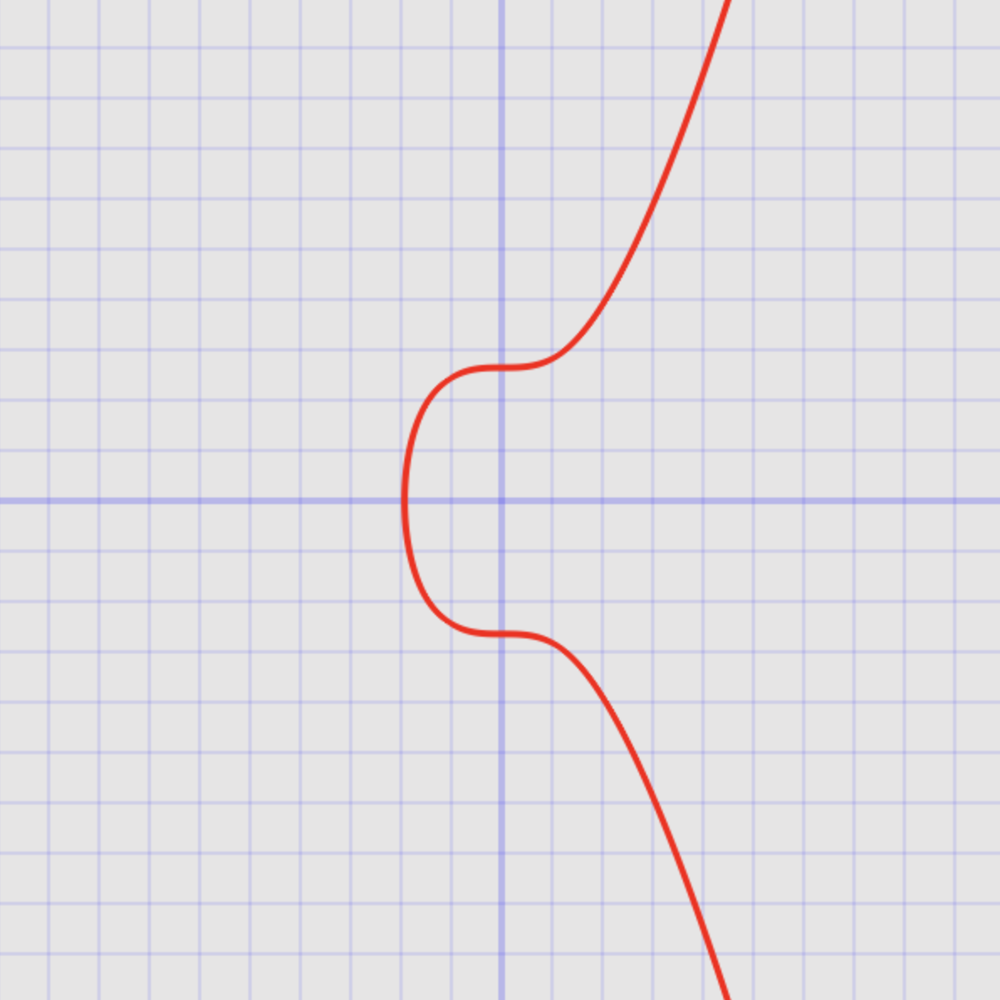

A Solidity library for performing arithmetic operations within a prime field, specifically tailored for the [secp256k1](https://en.bitcoin.it/wiki/Secp256k1) curve.

## Installation

To install with [**Foundry**](https://github.com/gakonst/foundry):

```sh
forge install 0xfuturistic/prime-field-arithmetic
```

## Features
- **Arithmetic in Prime Field**: Perform addition, subtraction, multiplication, and exponentiation within the constraints of a prime field.
- **Optimized for secp256k1 Curve**: Utilizes the widely recognized secp256k1 curve prime, ensuring compatibility with a broad range of cryptographic applications.
- **Solidity Optimized**: Crafted specifically for Solidity, providing efficient gas usage and performance in smart contract development.

## Use Cases
- **Cryptographic Operations**: Ideal for smart contracts requiring cryptographic computations, such as digital signatures, zero-knowledge proofs, and other cryptographic protocols.
- **Smart Contract Security:** Prevent underflows and overflows from ever happening by leveraging operations over a finite field using this library.
- **Interoperability with higher-level math**: Crucial for applications leveraging a high level of mathematical rigor and precision, such as in decentralized finance (DeFi) and cryptography.

## Getting Started
After installing, to integrate `PrimeFieldArithmetic` into your Solidity project:

```
import "prime-field-arithmetic/src/PrimeFieldArithmetic.sol";
```

Then add the following line to your contract:

```
using PrimeFieldArithmetic for uint256;
```

## Contribution
Contributions are welcome. Please adhere to standard coding practices and provide tests for new features.

## License
Distributed under the MIT License.
